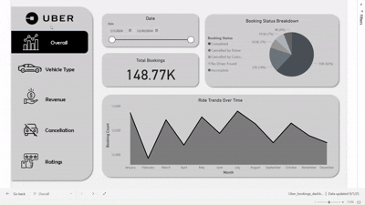
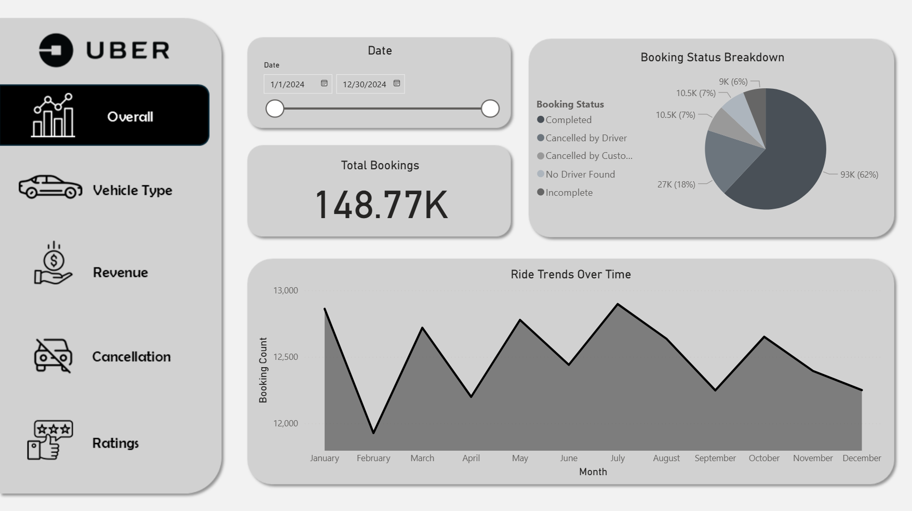
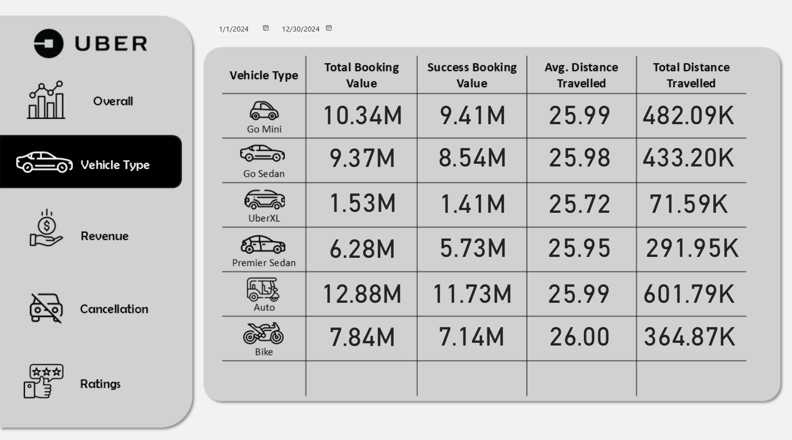
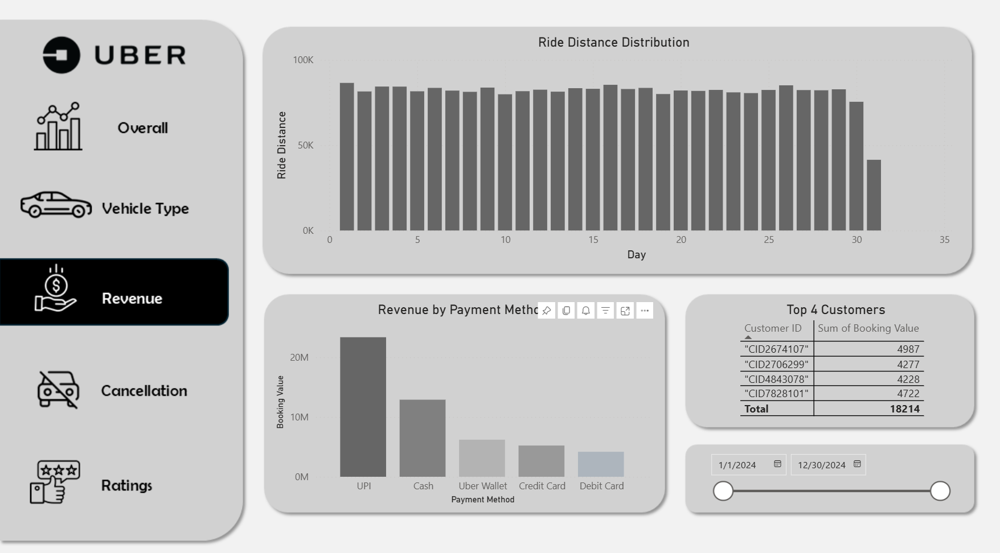
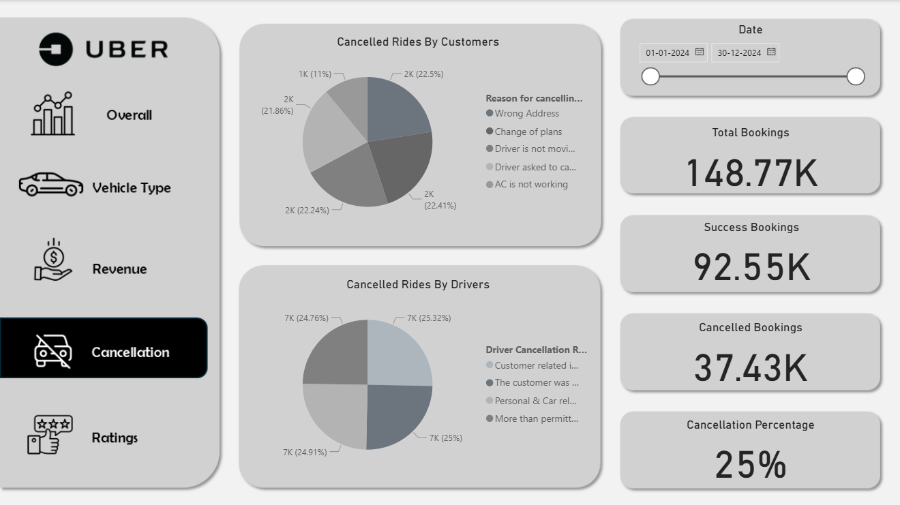
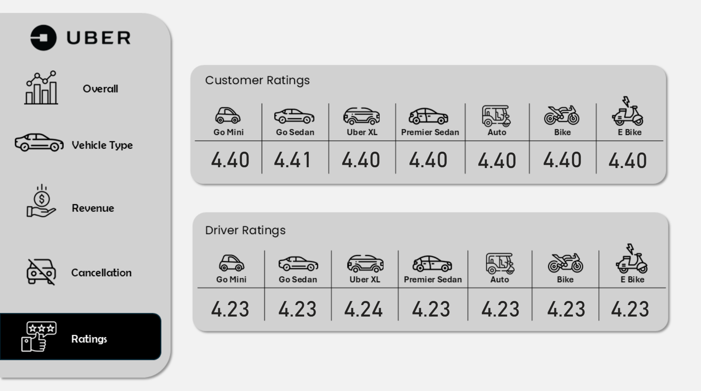

# Uber Booking Dashboard - Power BI

An interactive Power BI dashboard simulating Uber-style ride bookings and analytics.  
This dashboard is built with **Google Sheets** as the data source and showcases key metrics, trends, cancellations, revenue, and reviews across rides and vehicle types.

---

## Features & Pages

### 1. Overview Page
- Visualizes **ride trends over time**  
- Displays **total bookings** and **booking status breakdown**  
- Provides a quick summary of overall ride activity  

### 2. Vehicle Page
- Shows all **vehicle types** and related metrics in a table:  
  - Total booking value  
  - Successful booking value  
  - Average travel distance  
  - Total distance traveled  

### 3. Revenue Page
- Displays **revenue by payment method**  
- Highlights **top 4 customers** with total booking value  
- Shows **ride distance distribution** for analytics  

### 4. Cancellation Page
- Visualizes **cancelled rides by customers** and **by drivers**  
- Shows **total bookings, successful bookings, cancelled bookings**, and **cancellation percentage**  
- Helps analyze ride reliability and cancellation trends  

### 5. Reviews Page
- Displays **reviews by customers and drivers**  
- Segregates reviews based on **vehicle types**  
- Useful for understanding customer satisfaction and driver performance  

---

## Interactive Demo

Here’s a quick preview of the dashboard in action:

> *GIF demonstrates key interactions, filters, and KPIs across all pages.*

---

## Screenshots

### Overview Page

### Vehicle Page

### Revenue Page

### Cancellation Page

### Reviews Page

---

## Files in this Repo

- **Dashboard.pbix** → Power BI file to explore the dashboard yourself  
- **Demo/** → GIF showing dashboard interactions  
- **Screenshots/** → Key screenshots of dashboard pages  

---

## How to Use

1. Download the `Dashboard.pbix` file.  
2. Open it in **Power BI Desktop**.  
3. Connect to your Google Sheets data or replace with sample data.  
4. Interact with slicers, filters, and visuals to explore KPIs and trends.  

---

## Technologies & Skills

- **Power BI Desktop** for visualization  
- **DAX** for calculated measures (e.g., Cancellation %)  
- **Google Sheets** as a data source  
- Interactive dashboards with slicers, tables, and KPIs  

---

## Notes

- Demo GIF and screenshots provide a quick preview of all pages.  
- PBIX file allows full interaction and exploration.  
- Project demonstrates skills in **data visualization, analytics, and reporting** suitable for business intelligence or data analysis roles.
